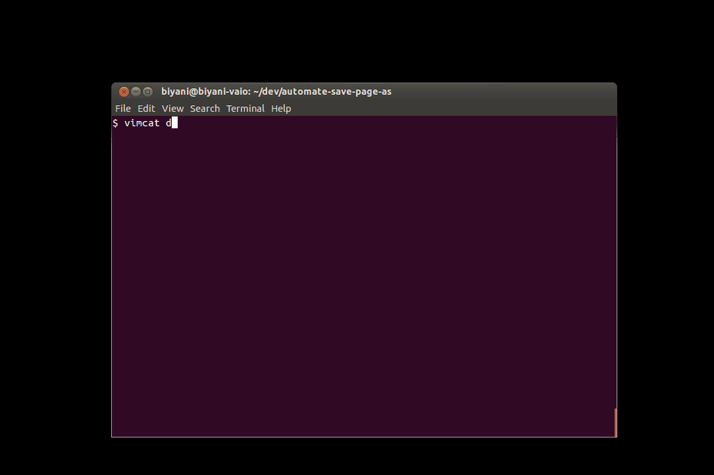

automate-save-page-as
=====================

*A quick hack for when `wget` doesn't cut it.*

**tldr; Perform browser's "Save page as" (Ctrl+S) operation from command line without manual intervention**



This small bash script *simulates* a sequence of key presses which opens a given url in the browser, save the page (Ctrl+S), and close the browser tab/window (Ctrl+F4). Chained together, these operations allow you to use the "Save Page As" (Ctrl+S) programtically (currently you can use either of `google-chrome` or `firefox`, and it's fairly straight forward to add support for your favorite browser).


*Examples:*
```
# Save your FB home page
$ ./save_page_as "www.facebook.com" --destination "/tmp/facebook_home_page.html"
```
```
# Use Firefox to open a web-page and save it in /tmp (the default name for the file (Page title) is used)
$ ./save_page_as "www.example.com" --browser "firefox" --destination "/tmp"
```
```
# Save a url with default name, but provide an additional suffix
$ ./save_page_as "www.example.com" --destination "/tmp" --suffix "-trial_save"
```
```
# List all available command line options.
$ ./save_page_as --help

save_page_as: Open the given url in a browser tab/window, perform 'Save As' operation and close the tab/window.

USAGE:
   save_page_as URL [OPTIONS]

URL                      The url of the web page to be saved.

options:
  -d, --destination      Destination path. If a directory, then file is saved with default name inside the directory, else assumed to be full path of target file. Default = '.'
  -s, --suffix           An optional suffix string for the target file name (ignored if --destination arg is a full path)
  -b, --browser          Browser executable to be used (must be one of 'google-chrome' or 'firefox'). Default = 'google-chrome'.
  --load-wait-time       Number of seconds to wait for the page to be loaded (i.e., seconds to sleep before Ctrl+S is 'pressed'). Default = 4
  --save-wait-time       Number of seconds to wait for the page to be saved (i.e., seconds to sleep before Ctrl+F4 is 'pressed'). Default = 8
  -h, --help             Display this help message and exit.
```

The script needs `xdotool` installed (http://www.semicomplete.com/projects/xdotool/): `sudo apt-get install xdotool` (for Ubuntu).

*Sidenote*: My particular use case while writing this script was crawling a bunch of web pages which were rendered almost entierly on client side using lots of javascript magic (thus saving output of `wget url` was useless). Since the browser is capable of rendering those pages, and also saving the post-render version on disk (using Ctrl+S), I wrote this script to automate the process (Tested on Ubuntu 12.04 and 14.04 myself).

Suggestions and/or pull requests are always welcome!
